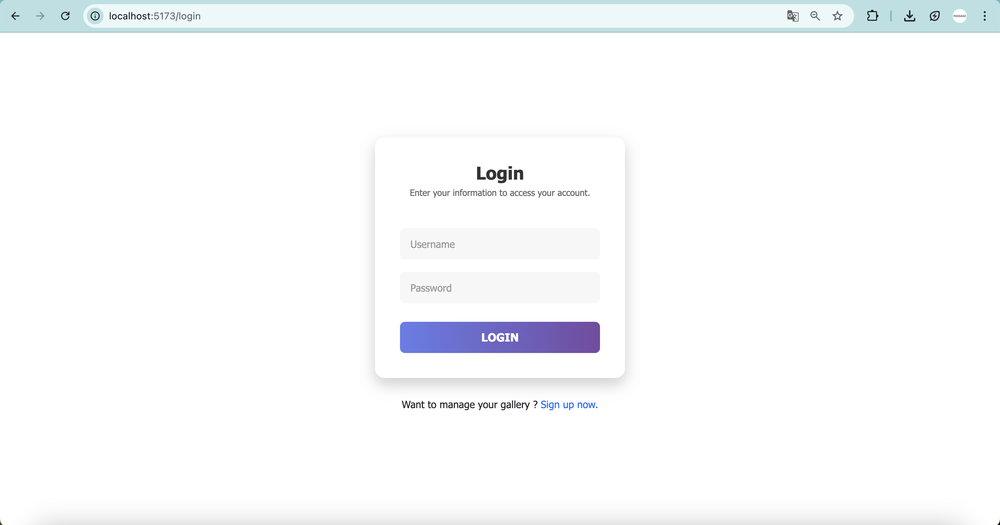
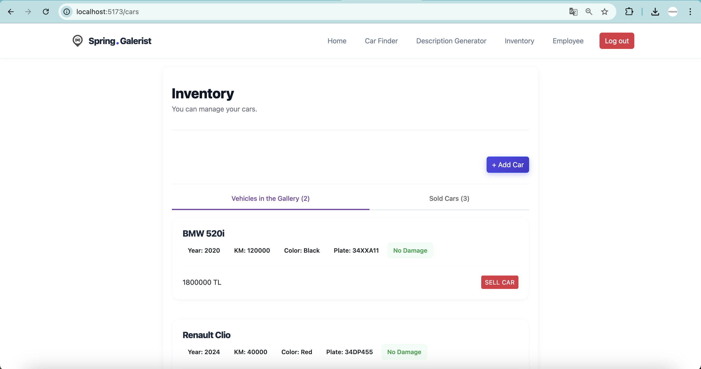
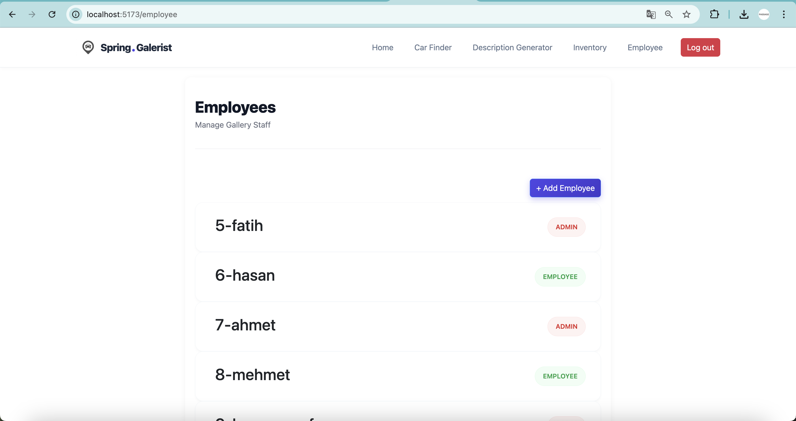

# 🚗 Gallerist Frontend - Modern Vehicle Management UI

   

Gallerist Frontend is a modern React web application that facilitates vehicle buying/selling processes, personnel management, and financial tracking. It communicates with a powerful Spring Boot Backend service to offer a secure and fast experience.

---

## 🔥 Features

The application has a structure that dynamically adapts based on the user role (Admin/Employee).

### 🔐 Authentication & Security
* Login & Register: JWT-based secure sign-in.
* Role-Based Access Control (RBAC): Distinct menus and permissions for Admin and Personnel (Employee).

### 🤖 AI Powered Features
* AI Vehicle Search (Car Finder): Search for vehicles using natural language queries (e.g., "Find me a low-budget SUV suitable for families") powered by artificial intelligence.
* AI Description Generator: Automatically generates compelling and detailed sales descriptions for vehicles based on their technical specifications to enhance marketing.

### 👨‍💼 Management Panel (Admin Only)
* Personnel Management: Adding new employees and listing current staff.
* Financial Tables: Profit/Loss status, total turnover, and graphical/tabular analysis of sold vehicles.

### 🚘 Vehicle & Sales Operations
* Vehicle Inventory: Listing and filtering all vehicles in the gallery.
* Add Vehicle: Entry of new vehicles into the system with brand, model, year, price, and technical specifications.
* Sales Module: Instant sales transaction with customer information (ID Number, Address, Name).
* Sales Confirmation: Confirmation mechanism powered by SweetAlert2 to prevent accidental sales.

---

## 📸 Screenshots

Images from the project interface including the AI features.

| Login Screen | Dashboard & Profit Table |
|:---:|:---:|
|  |  |
| *Secure Login Panel* | *Admin Overview* |

| AI Car Finder | AI Description Generator |
|:---:|:---:|
|  |  |
| *Natural Language Search* | *Automatic Sales Text Generation* |

| Vehicle List & Inventory | Sales Transaction |
|:---:|:---:|
|  |  |
| *Vehicle Inventory* | *Sales and Customer Form* |

---

## 🛠 Technologies Used

* Core: React.js (Hooks, Context API)
* Routing: React Router DOM v6
* HTTP Client: Axios (with Interceptor structure)
* AI Integration: OpenAI API / Custom AI Integration
* Styling: CSS3 (Custom Grid/Flex Layouts)

---

## 🚀 Installation

Follow the steps below to run the project in your local environment.

### 1. Clone the Project
git clone https://github.com/fatihsenguun/reactgallerist.git
cd gallerist-frontend

### 2. Install Dependencies
npm install

### 3. Start the Project
npm run dev
